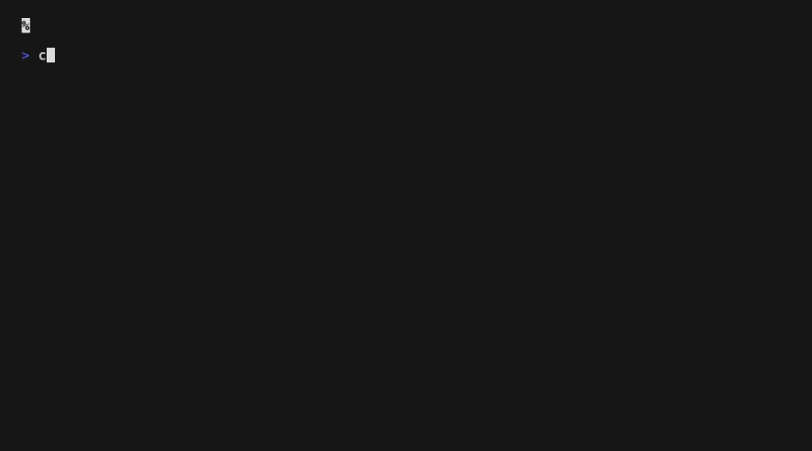

# chbedcl

Change the Claude model in `~/.claude/settings.json` by querying available models from AWS Bedrock.



## Install

### Homebrew

```sh
brew tap joaoqalves/chbedcl https://github.com/joaoqalves/chbedcl.git
brew trust --formula joaoqalves/chbedcl/chbedcl
brew install chbedcl
```

### Go

```sh
go install github.com/joaoqalves/chbedcl@latest
```

### From source

```sh
git clone https://github.com/joaoqalves/chbedcl.git
cd chbedcl
go build -o chbedcl .
```

## Usage

### Interactive (TUI)

```sh
chbedcl
```

Arrow keys to navigate, type to filter, enter to select.

### Headless (agent-friendly)

```sh
# List available models
chbedcl --list

# List as JSON (includes current model)
chbedcl --list --json

# Set a model directly
chbedcl --set us.anthropic.claude-opus-5

# Show current model
chbedcl --current
```

### Flags

| Flag | Description |
|------|-------------|
| `--region`, `-r` | AWS region |
| `--profile`, `-p` | AWS profile |
| `--refresh` | Force cache refresh |
| `--list` | List models and exit |
| `--set <model>` | Set model directly |
| `--current` | Print current model |
| `--json` | Output as JSON |

## How it works

1. Queries `bedrock:ListFoundationModels` via the AWS SDK
2. Filters to active Claude models that support inference profiles
3. Constructs cross-region inference profile IDs (e.g., `us.anthropic.claude-opus-5`)
4. Caches results in `~/.claude/chbedcl-cache.json` for 48 hours
5. Updates the `"model"` field in `~/.claude/settings.json`
6. Syncs the `"env"` block so `AWS_PROFILE`/`AWS_REGION` match the resolved
   profile/region and `CLAUDE_CODE_USE_BEDROCK` is set to `"1"`

## Requirements

- AWS credentials configured (`~/.aws/config` or environment variables)
- IAM permission: `bedrock:ListFoundationModels`

## License

MIT
